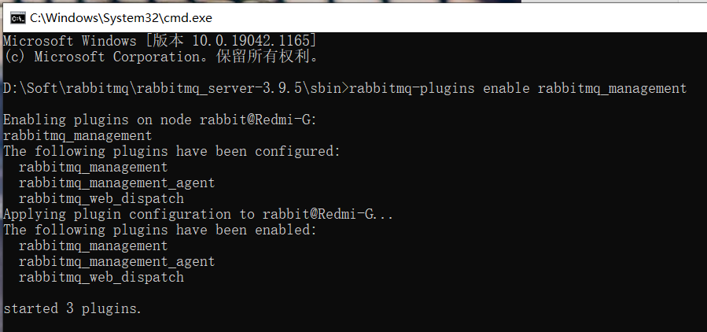

安装RabbitMQ成功后

# 1.配置环境变量：

由于win10系统用户名为中文，因此此处rabbitmq系统变量设置为：

```ABAP
变量名：RABBITMQ_BASE
变量值：安装的全路径
```


# 2.系统变量Path中

添加

```ABAP
%RABBITMQ_BASE%\sbin
```


# 3.安装插件rabbitmq-plugins

在安装目录的sbin下执行命令：

```ABAP
rabbitmq-plugins enable rabbitmq_management
```




# 4.启动服务

```ABAP
rabbitmq-service start
```


没有关系下面才是重头戏！


# 5.管理员身份执行命令

```ABAP
net stop RabbitMQ
net start RabbitMQ
```


输入http://localhost:15672/


用户名和密码都为 :guest

